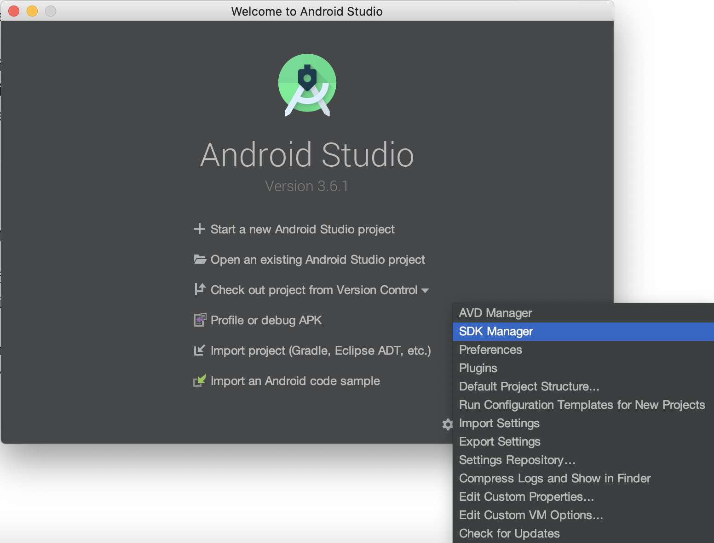
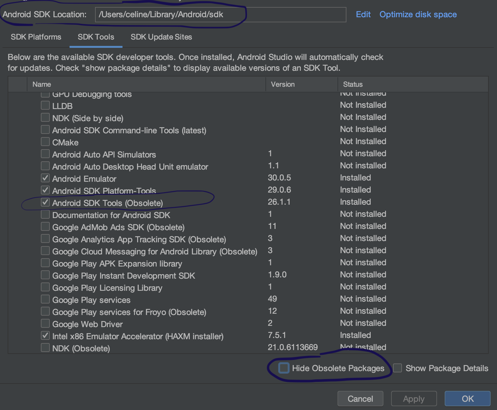

Flutter est un framework de conception d'applications multiplateforme pour Android et ios. Cet article détaillera les étapes d'installations de Flutter sur Mac.

##Récupération du SDK Flutter

Pour commencer, il faut récupérer le SDK de Flutter. L'installation de Flutter inclu aussi Dart. Il n'y a donc pas besoin de l'installer manuellement.

Pour récupérer Flutter, le plus simple est de cloner le repository git:

```
# Dans /workspace
$ git clone https://github.com/flutter/flutter.git -b stable
```

Mais il est aussi possible de le télécharger ici https://flutter.dev/docs/development/tools/sdk/releases, puis de dézipper le fichier télécharger.

Afin de pouvoir utiliser Flutter en ligne de commande, il faut le déclarer soit dans $HOME/.bash_profile ou dans $HOME/.bashrc:

```
# Dans$HOME/.bash_profile
export FLUTTER_PATH=/workspace/flutter/bin export PATH="$PATH:$FLUTTER_PATH"
```

Rafraichir notre session avec la commande:

```
$HOME/.bash_profile
```

`flutter doctor` peut alors être utilisée. Il s'agit d'une commande qui permet de savoir si toutes les dépendances requises sont bien installées:

```
$ flutter doctor
```

La réponse obtenue à l'écran nous amène à l'étape suivante de l'installation: le setup d'Android Studio.

```
Doctor summary (to see all details, run flutter doctor -v):
[✓] Flutter (Channel stable, v1.12.13+hotfix.8, on Mac OS X 10.15.3 19D76,
    locale en-FR)
[-] Android toolchain - develop for Android devices
    • Android SDK at /Users/obiwan/Library/Android/sdk
    ✗ Android SDK is missing command line tools; download from https://developer.android.com/studio#downloads
    • Try re-installing or updating your Android SDK,
      visit https://flutter.dev/setup/#android-setup for detailed instructions.
```

##Récupération du SDK Android

La commande `flutter doctor` nous indique où télécharger Android Studio: "download from https://developer.android.com/studio#downloads". Ce lien amène à télécharger un fichier exécutable Mac.

Après l'avoir lancé, nous configurons l'IDE via le "Android Studio Setup Wizard" et nous finissons par arriver à l'écran suivant:



Dans l'onglet "SDK Tools" de la nouvelle fenêtre qui s'ouvre, nous décochons "Hide Obsolet Packages" pour afficher voir s'afficher l'option **Android SDK Tools (Obsolete)**.

A noter aussi où se trouve le SDK /Users/celine/Library/Android/sdk.



Cette étape où nous devons spécifier un SDK antérieur à la dernière version est un problème connu de Flutter "This is a [known issue](https://github.com/flutter/flutter/issues/51712) that will be addressed in an upcoming version of Flutter".

A l'état actuel, Flutter ne détectera pas encore le SDK:

```
$ flutter doctor

Doctor summary (to see all details, run flutter doctor -v):
[✓] Flutter (Channel stable, v1.12.13+hotfix.8, on Mac OS X 10.15.3 19D76,
    locale en-FR)
[!] Android toolchain - develop for Android devices (Android SDK version 29.0.3)
    ✗ Android SDK file not found: adb.
```

Il faut encore déclarer nos variable d'environnement dans notre $HOME/.bash_profile. Ce qui abouti au fichier suivant:

```
# Dans$HOME/.bash_profile
export FLUTTER_PATH=/workspace/flutter/bin export ANDROID_HOME=/Users/celine/Library/Android/sdk export PATH="$PATH:$FLUTTER_PATH:$ANDROID_HOME/tools:$ANDROID_HOME/platform-tools"
```

> Remarquons ici l'exécutable adb se trouve dans $ANDROID_HOME/platform-tools/platform-tools/adb (oui il y a un dossier platform-tools dans le dossier platform-tools).

> Même en spécifiant le chemin export PATH="$PATH:$FLUTTER_PATH:$ANDROID_HOME/tools:$ANDROID_HOME/platform-tools/platform-tools" dans le .bash_profile, flutter ne trouve pas l'exécutable adb.

> Il a donc fallu remonter le sous-dossier platform-tools au niveau du $ANDROID_HOME.

Exécuter ensuite la commande suivante pour accepter les licenses:

```
$ flutter doctor --android-licenses
```

Et voilà! Flutter est maintenant configuré correctement. flutter doctor confirme que l'installation s'est bien passé:

```
Doctor summary (to see all details, run flutter doctor -v):
[✓] Flutter (Channel beta, v1.15.17, on Mac OS X 10.15.3 19D76, locale en-FR)
[✓] Android toolchain - develop for Android devices (Android SDK version 29.0.3)
```

Prochaine étape: démarrer ma première application Flutter sur mon téléphone Android ! **Lien vers l'article à venir**
