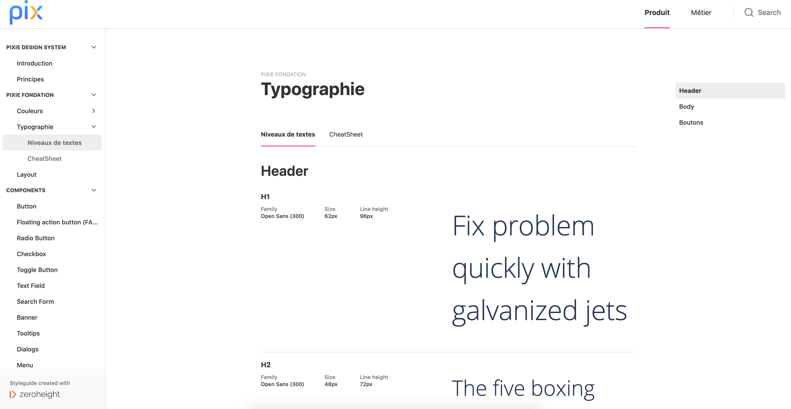
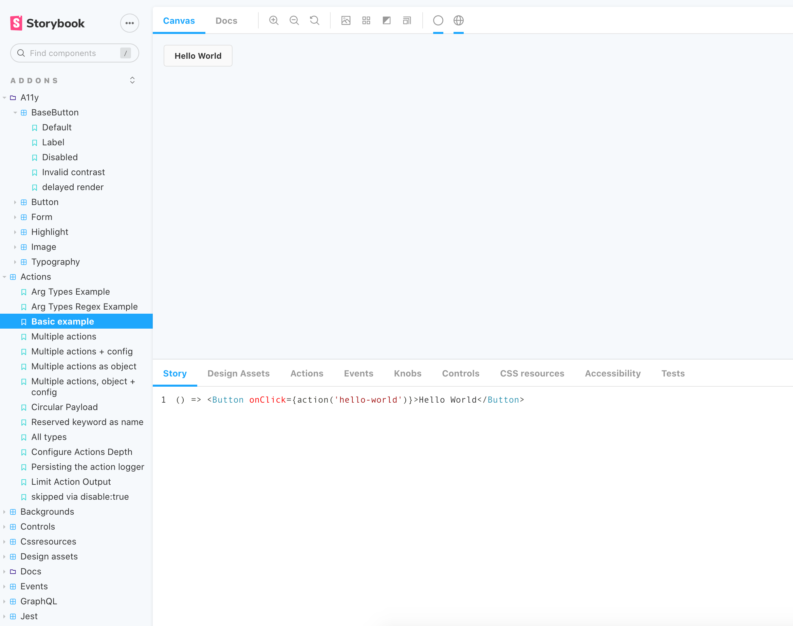

Chez mon client j'ai eu l'occasion de participer à la mise en place d'un design system.

Je vais partager dans cet article les problèmes que nous avons rencontrés qui ont amenés à la mise en place de ce design system et comment nous intégrons ce design system dans notre environnement de travail.

## Les problèmes

Nous avons plusieurs applications web qui sont chacune maintenues par des équipes différentes. Bien que toutes les équipes sont proches et communiquent ensemble, nous avons parfois l'impression de coder plusieurs fois la même chose sur chaque application.

En effet, ces applications représentent la même marque et sont donc visuellement similaires: même typographie, mêmes couleurs, mêmes icônes, etc. On retrouve aussi les mêmes blocs d'éléments graphiques dans plusieurs applications (boutons identiques, style de lien similaire, pareil concenant la navigation, etc).

Cependant, même si nous avons la volonté de faire des applications avec le même style, nous nous rendons compte qu'il est trop facile de diverger. 

**Résultat**: nous avons fini par nous retrouver avec des palettes de couleurs différentes pour chaque application, des champs 'date' visuellement identique mais au comportement différent (dans un cas, l'utilisateur avait le focus automatiquement au champs 'mois' après avoir saisi le 'jour' alors que dans un autre cas il fallait qu'il change le champs manuellement), etc.

Cela entraîne:

- une incohérence visuelle dans l'écosystème &rarr; dette design
- une redondance et duplication de code &rarr; dette technique
- une perte de temps (et d'argent pour le client)
- une perte d'identité visuelle de la marque (pour l'utilisateur, il peut ne pas remarquer qu'il s'agit d'applications de la même marque)
- une expérience utilisateur dégradée

## La solution adoptée

Nous avons alors choisi de mettre en place un design system.

Le design system est un terme large qui regroupe:

- un style guide
- une bibliothèque de référence

Le **style guide**, comme son nom l'indique, est un guide contenant le style graphique qui constitue l'identité unique de la marque. Nous y trouvons des informations sur les couleurs, les polices utilisées, les images, etc. Mais il ne contient pas seulement des éléments visuels, mais aussi des éléments explicatifs (par exemple quand utiliser telle ou telle couleur).

Nous nous sommes orientés vers ZeroHeight pour mettre en place ce style guide:

Cette image est tirée du [Storybook de Pix]([1024pix.github.io/pix-ui/](https://1024pix.github.io/pix-ui/)).

La **bibliothèque de référence** contient des éléments réutilisables: maquettes, fichiers Astract/Sketch/etc, bout de code... 

Nous avons implémenté la bibliothèque de référence sous [Storybook](https://storybook.js.org): 

Sur l'image (tirée de https://next--storybookjs.netlify.app/official-storybook/?path=/story/addons-a11y-basebutton--default), la liste des composants est à gauche. En cliquant dessus, le rendu visuel, un exemple d'utilisation du composant et une documentation s'affichent.

> Je vous invite aussi à consulter d'autre exemples sur Storybook et ZeroHeight:
>
> - exemples ZeroHeight: https://zeroheight.com/showcase
> - exemples Storybook: https://storybook.js.org/docs/react/get-started/examples

## Place du design system dans notre organisation

Le design system a été mis en place depuis maintenant plusieurs mois chez mon client.

Il sert de base de communication entre les développeurs et les UX/UI designers. Il permet aussi de garder une cohérence visuelle entre les différentes applications.

Le design system n'est pas figé: il est évolutif et réutilisable. Tout comme nos applications front ne cessent d'évoluer et d'être enrichies, le design system évolue également.

Nous n'avons pas d'équipe dédié spécifiquement au design system. Chaque développeur, lorsqu'il développe, doit se poser les questions suivantes:

- ce bloc est-il déjà présent dans les applications ?
- le designer a-t-il identifié des blocs comme étant réutilisables ?

Si c'est le cas, ce bloc a sa place dans le design system.

> Développer ce bloc à part dans le design system et l'importer ensuite peut sembler plus long et fastidieux, mais il s'agit au final d'un gain de temps puisqu'il sera réutilisé.

