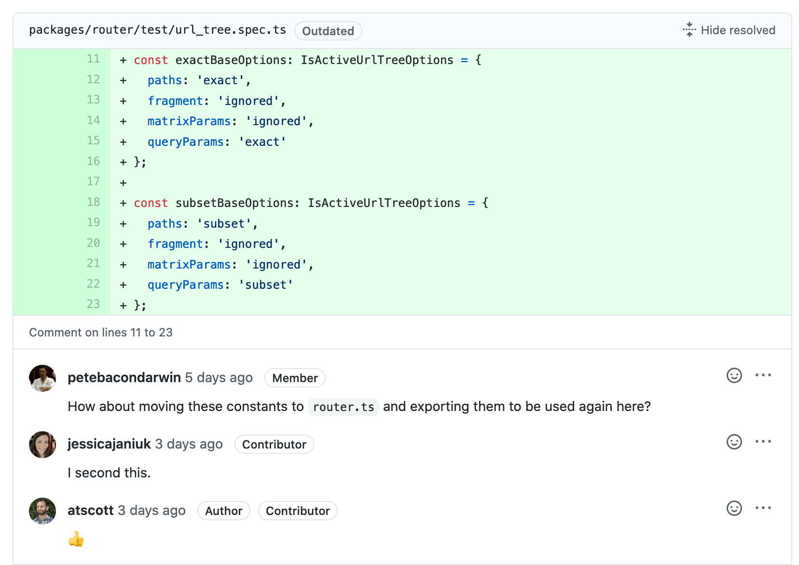

## Des revues de code effectives avec les conventional comments

Il y a quelques temps, j'ai eu l'occasion de m'essayer au [*conventional comments*](https://conventionalcomments.org/) lors des revues de code. Depuis, j'ai adopté la pratique: les actions attendues suite à un commentaire sur un bout de code sont devenues plus claires.

J'aborderai dans un premier temps dans cet article pourquoi je trouve les revues de code importantes, puis comment j'exprime mon intention derrière une revue de code via les [*conventional comments*](https://conventionalcomments.org/).

### Pulls requests: l'union fait la force

Au cours de mes missions, j'ai croisé plusieurs façon d'intégrer du nouveau code dans la base de code commune. Dans le pire des cas, les nouveaux développements peuvent soient:

- être directement mergés dans la branche de travail principale
- ou bien être mergés après validation de collègues qui ne leur ont pas accordé ni l'attention ni le temps nécéssaire

> Attention, si vous codez sans pensez à votre relecteur (grand nombre de fichiers, inclusion de nouvelles fonctionnalités hors-scope, refactorisation tunnel qui peuvent être faits à postériori, etc), vous comprendrez que la revue de code ne sera pas simple! Pensez à faire des commits atomiques, avec des noms de commits parlant (cf: conventionnal commit) et un enchaînement de commits qui traduit votre chemin de pensée.

Certaines personnes pensent que les revues de code ne sont pas nécessaires et sont une perte de temps.

Pourtant, nous travaillons tous sur la même base de code et sommes amenés à repasser derrière le travail  de nos collègues. Il arrive que nous remarquons que le nom de la variable ne nous plaît pas, qu'il manque des tests unitaires, que certaines fonctions sont trop lourdes, que la fonctionnalité ne marche pas en fait, etc. Alors j'ai envie de vous dire: vous ne pouvez vous en prendre qu'à vous même. Il fallait manifester vos remarques lors de la revue de code. Bien sûr, il n'est pas trop tard pour corriger. Mais notez bien que vous avez autant de responsabilité sur le code que votre collègue qui l'a écrit. Il ne faut pas blâmer le codeur, mais l'équipe. Le code n'appartient pas à un seul individu, mais à toute l'équipe. C'est ce que l'on appelle l'**egoless programming**.

Les revues de code permettent d'augmenter la qualité du code et de s'assurer que la base de code finale convient à tout le monde.

Exemple de revue sur la [Pull Request #40303 de Angular](https://github.com/angular/angular/pull/40303):

### Transmettre son intention lors d'une revue de code

Imaginons que nous avons à présent développé une nouvelle fonctionnalité prête à être mergée et nos collègues ont commencé à faire de la revue dessus.

Nous pouvons y lire les commentaires suivants:

- "Pourquoi mettre le background-color à #F4F5F7?"
- "On utilise déjà le nommage `rdn` ailleurs, mais je trouve que ce n'est pas parlant"
- "Attention, cette librarie est dépréciée"

Chacun de ces commentaires sont pertinents. Mais que faut-il vraiment modifier du code pour que l'on puisse le considérer comme "validé"? Ici, **les intentions des commentateurs ne sont pas explicitement véhiculés.** 

Qu'est-ce qui est vraiment bloquant? Le commentateur demande-t-il des explications sur le choix du background-color ou est-il est désaccord avec ce choix? La variable `rdn` étant utilisée ailleurs, le commentateur demande-il ici de renommer la variable dans tout le code ou simplement dans la fonction concernée? La suppression de la librairie dépréciée doit-elle être faite dans cette Pull Request ou bien peut-elle être faite plus tard?

La pratique [*conventional comments*](https://conventionalcomments.org/) préconise de préfixer le commentaire par un mot-clé.

En reprenant l'exemple précédent:

- **question: **Pourquoi mettre le background-color à #F4F5F7? Était-ce dans la maquette?
- **suggestion:** Pourquoi mettre le background-color à #F4F5F7? Je trouve que #FAFBFC propose un meilleur contraste.

Je reprends la [documentation officielle de conventional comment pour indiquer les mots-clés suggérés](https://conventionalcomments.org/):

| Keyword         | Intention                                                    |
| --------------- | ------------------------------------------------------------ |
| **nitpick:**    | Nitpicks are small, trivial, but necessary changes. Distinguishing  nitpick comments significantly helps direct the reader's attention to  comments requiring more involvement. |
| **nitpick:**    | Nitpicks are small, trivial, but necessary changes. Distinguishing  nitpick comments significantly helps direct the reader's attention to  comments requiring more involvement. |
| **suggestion:** | Suggestions propose improvements to the current subject. It's important to be explicit and clear on *what* is being suggested and *why* it is an improvement. Consider using patches and the *blocking* or *non-blocking* [decorations](https://conventionalcomments.org/#decorations) to further communicate your intent. |
| **issue:**      | Issues highlight specific problems with the subject under review.  These problems can be user-facing or behind the scenes. It is strongly  recommended to pair this comment with a `suggestion`. If you are not sure if a problem exists or not, consider leaving a `question`. |
| **question:**   | Questions are appropriate if you have a potential concern but are  not quite sure if it's relevant or not. Asking the author for  clarification or investigation can lead to a quick resolution. |
| **thought:**    | Thoughts represent an idea that popped up from reviewing. These  comments are non-blocking by nature, but they are extremely valuable and can lead to more focused initiatives and mentoring opportunities. |
| **chore:**      | Chores are simple tasks that must be done before the subject can be  “officially” accepted. Usually, these comments reference some common  process. Try to leave a link to the process description so that the  reader knows how to resolve the chore. |

A présent, je vous invite à essayer et propager cette pratique au sein de votre équipe de développement. La communication sera plus claire !

