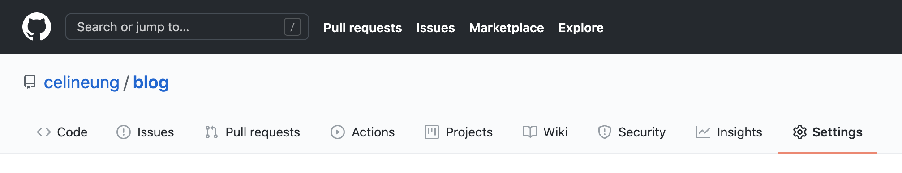
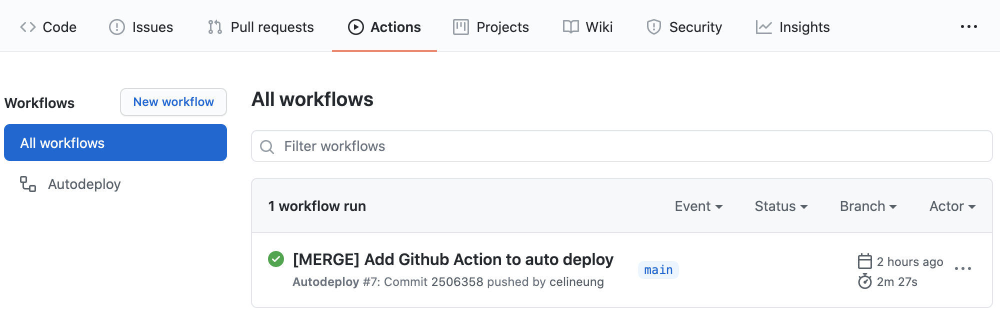

## Qu'est-ce que les Github Actions ?

Les [Github Actions](https://docs.github.com/en/actions) permettent de déclarer des "actions" qui vont se déclencher automatiquement à certains moments de notre flux de travail.

Par exemple, on peut définir une action qui va merger automatiquement une PR si elle a reçue au moins deux validations, ou encore une action qui va déplacer un ticket sur notre board Jira dès qu'une PR est mergée.

Dans cet article, on va créer une Github Action qui envoie un message sur Slack contenant la version du `package.json` à chaque merge sur la branche dev.

## Comment Github Actions fonctionne

- À la racine du projet, créer le dossier `.github/workflows`

- Dans ce nouveau dossier, y créer le fichier `send-message-to-slack.yml` contenant: 

```yaml
name: Send project version to Slack

on:
  push:
    branches:
      - master

jobs:
  send-message-to-slack:
    name: Send message to Slack
    runs-on: ubuntu-latest
    steps:
      - uses: actions/checkout@v2
      - name: Retrieve version
        id: retrieve-version
        run: |
          version=$(node -p "require('./package.json').version")
          echo "##[set-output name=version;]$version"
```

**Que fait ce fichier ?**

| Lignes du fichier                                            | Explications                                                 |
| ------------------------------------------------------------ | ------------------------------------------------------------ |
| name: Send project version to Slack                          | Le nom du workflow qui apparaîtra dans l'onglet Actions de Github |
| on:<br/>  push:<br/>    branches:<br/>      - master<br />   | Le workflow créé sera déclenché à chaque push sur la branche `master`. <br />Si comme moi vous travaillez sur une branche de développement et que vos commits sur master viennent de merges de la branche de développement, alors le workflow sera déclenché à chaque merge sur la branche `master`. |
| jobs:                                                        | Liste des jobs du workflow.<br />Un job liste un ensemble de `steps` qui se lancent sur le même serveur, appelé ici `runner`. Par défaut, les jobs déclarés démarrent en parallèle. |
| send-message-to-slack:                                       | Nom du job.                                                  |
| name: Send message to Slack                                  | Nom du job. Si spécifié, il s'agit alors de celui-ci qui sera affiché dans l'onglet Github. |
| runs-on: ubuntu-latest                                       | Le job se lance sur une VM Linux hébergée par Github. Il est possible d'utiliser d'[autres runners](https://docs.github.com/en/actions/reference/workflow-syntax-for-github-actions#jobsjob_idruns-on). |
| steps:                                                       | Regroupe les `steps` du job `share-xpi`. Un step est soit une action (utilisé via le mot-clé `uses`), soit une commande shell (utilisé via le mot-clé `run`).<br />Dans notre exemple ici, nous avons 2 steps. |
| - uses: actions/checkout@v2                                  | Le premier step de notre job utilise l'action [Checkout](https://github.com/marketplace/actions/checkout) du marketplace Github. Cette action va récupérer le repository et le télécharger sur le runner. |
| - name: Retrieve version                                     | On attribue un nom plus explicite au deuxième step de notre job. Ce sera lui qui sera affiché dans notre onglet Github. |
| id: retrieve-version                                         | J'attribue un id à ce step pour pouvoir récupérer son output dans la suite du job. |
| run: \|<br />version=$(node -p "require('./package.json').version")<br />echo "##[set-output name=version;]$version" | `run` indique ici que l'on va démarrer des commandes shell.<br />La barre vertical permet d'exécuter plusieurs commandes.<br /><br />La première ligne `version=$(node -p "require('./package.json').version")` récupère la version du `package.json` dans une variable que l'on nomme `version`.<br /><br />La deuxième ligne `echo "##[set-output name=version;]$version"` stocke la variable précédente dans le step. |

Pour résumer: jusqu'à présent, nous nous sommes placés à l'intérieur de notre projet et avons récupéré sa version du `package.json`.

Il nous reste maintenant à nous interfacer avec Slack pour lui envoyer notre message contenant le numéro de version.

## Interfaçage avec Slack

### Créer un Github Action Secret contenant notre token Slack

Pour pouvoir nous connecter avec Slack, nous avons besoin de lui indiquer un token. Si vous n'en avez pas déjà un, il est possible d'en créer un [ici](https://1024pix.slack.com/apps/A0F7XDUAZ-incoming-webhooks).

Ensuite, il suffit de l'indiquer via les [Github Action Secret](https://docs.github.com/en/actions/reference/encrypted-secrets#creating-encrypted-secrets-for-a-repository):



Appelons ici le secret qui contient le token Slack `SLACK_TOKEN`.

### Chercher une Github Action existante d'envoi de message Slack

Sur le marketplace de Github, il existe le Github Action [Slack Notify](https://github.com/marketplace/actions/slack-notify) qui nous permet d'envoyer un message Slack.

Le fichier `send-message-to-slack.yml` devient finalement:

```yaml
name: Send project version to Slack

on:
  push:
    branches:
      - master

jobs:
  send-message-to-slack:
    name: Send message to Slack
    runs-on: ubuntu-latest
    steps:
      - uses: actions/checkout@v2
      - name: Retrieve version
        id: retrieve-version
        run: |
          version=$(node -p "require('./package.json').version")
          echo "##[set-output name=version;]$version"
      - name: Send Slack Notification
        uses: rtCamp/action-slack-notify@v2
        env:
          MSG_MINIMAL: true
          SLACK_CHANNEL: Updates
          SLACK_MESSAGE: "A new version has been deployed.\nVersion: ${{steps.retrieve-version.outputs.version}}"
          SLACK_TITLE: Release v${{steps.retrieve-version.outputs.version}}
          SLACK_WEBHOOK: ${{ secrets.SLACK_TOKEN }}
```

**Explications des nouvelles lignes**

| Lignes du fichier                                            | Explications                                                 |
| ------------------------------------------------------------ | ------------------------------------------------------------ |
| - name: Send Slack Notification                              | Nom du nouveau `step`.<br />Le job contient désormais trois `steps`. |
| uses: rtCamp/action-slack-notify@v2                          | Utilisation du Github Action: Slack Notify                   |
| env:                                                         | Contient les variables d'environnements nécessaires au fonctionnement de Slack Notify |
| MSG_MINIMAL: true                                            | Slack Notify ajoute les informations `Ref`, `Event`, `Actions URL` et`Commit` au message. En mettant l'option `MSG_MINIMAL`, ces informations ne sont pas affichées. |
| SLACK_CHANNEL: Updates                                       | Indique d'nvoyer le message au channel #Updates              |
| SLACK_MESSAGE: "A new version has been deployed.\nVersion: ${{steps.retrieve-version.outputs.version}}" | Définit le corps du message.<br />Remarquons ici que la sortie du step précédent est récupéré et injecté via `steps.[ID-DU-STEP].outputs.[NOM-DE-LA-VARIABLE]`.<br />La string est entouré de quote car un `\n` y a été inséré pour indiquer un retour à la ligne.<br />Dommage, `SLACK_MESSAGE` ne comprend pas encore le markdown. |
| SLACK_TITLE: Release v${{steps.retrieve-version.outputs.version}} | Le titre du message Slack                                    |
| SLACK_WEBHOOK: ${{ secrets.SLACK_TOKEN }}                    | Indiquer ici le token Slack ajouté à l'étape précédente dans les Action Secrets. |

Et voilà, nous avons notre Github Action qui envoit un message Slack !


## Un autre exemple de Github Action

Pour voir un autre exemple, dans [ce cas](https://github.com/celineung/blog/blob/main/.github/workflows/auto-deploy.yml) j'ai mis en place une Github Action qui déploie un site statique sur gh-pages.

Dans l'onglet "Actions" du repository, nous constatons que le workflow "Autodeploy" a été lancé avec succès sur le commit "[MERGE] Add Github Action to auto deploy" de la branche `main`.



