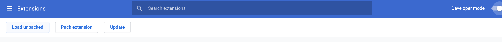
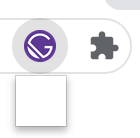
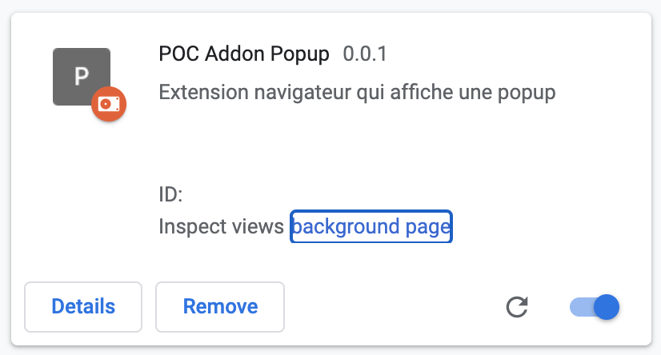
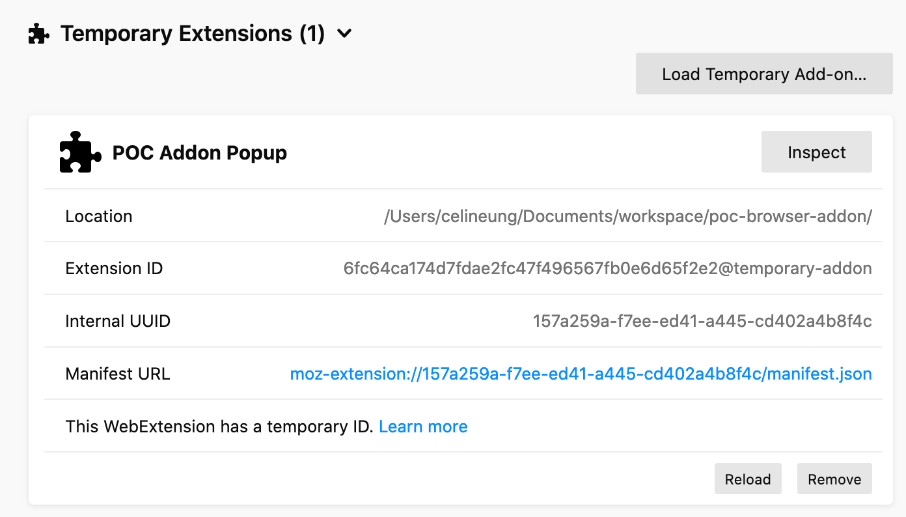

Dans cet article, je vais m'intéresser au développement d'un addon Firefox et Chrome qui affiche une popup.

Les API d'intéractions avec Chrome sont différents de ceux de Firefox. La première partie de cet article introduit la création d'un addon. Si ce qui vous intéresse est comment rendre l'addon compatible sur ces deux navigateurs, je vous invite à lire <a href="#chrome-firefox-api">cette section</a>. 

Le code utilisé dans cet article se trouve [ici](https://github.com/celineung/poc-browser-addon).

## Écrire le manifest.json

Le fichier manifeste.json contient les métadonnées de l'addon (comme son nom et sa version), référence les scripts nécessaires à son lancement et les permissions accordées.

Commençons par créer le dossier **poc-browser-addon** contenant ce manifest.json:

```json
{
  "manifest_version": 2,
  "name": "POC Addon Popup",
  "description": "Extension navigateur qui affiche une popup",
  "version": "0.0.1",
  
  "background": {
    "scripts": ["background.js"]
  },
  
  "browser_action": {
    "default_icon": "gatsby-icon.png",
    "default_title": "My Addon",
    "default_popup": "popup.html"
  },
}
```

Le fichier background.js est un fichier qui sera lancé au chargement de l'extension. D'après [la documentation MDN](https://developer.mozilla.org/fr/docs/Mozilla/Add-ons/WebExtensions/manifest.json/arriere-plan):

> Les scripts d'arrière-plan sont l'endroit pour placer le code qui doit maintenir l'état à long terme, ou effectuer des opérations à long terme, indépendamment de la durée de vie de toutes les pages Web ou les fenêtres du navigateur.

La propriété "browser_action" permet de définir une icon à afficher sur le bouton de l'extension ainsi que une popup qui s'affiche lors d'un clic.

## Lancer l'addon sur Chrome et Firefox

A cette étape, nous avons simplement initialisé l'addon avec le fichier manifest.json. L'addon n'est pas encore packagé et ne comporte aucune fonctionnalité pour le moment. Néanmoins, il est possible de le lancer localement sur son navigateur.

Sur Chrome:

- Se rendre sur [chrome://extensions](chrome://extensions)
- Activer le "mode développeur". Une nouvelle zone s'affiche et permet de sélectionner l'addon à charger.
- Cliquer sur "Load unpacked"
- Dans la popup qui s'ouvre, sélectionner le dossier *poc-browser-addon*



Et voilà! L'icône de notre addon s'affiche sur notre navigateur:



En cliquant sur l'addon, un petit carré blanc s'affiche: c'est normal, notre popup ne contient rien pour l'instant.

> Si l'extension ne s'affiche comme si l'image précédente, vous avez sûrement besoin de la fixer. Pour cela, cliquez sur l'icon de l'extension en forme de puzzle, visible sur l'image précédente.


Sur firefox:

- Se rendre sur [about:debugging#/runtime/this-firefox](about:debugging#/runtime/this-firefox)
- Cliquer sur "Load temporary Add-on..."
- Dans la fenêtre qui s'affiche, cliquer sur n'importe quel fichier du dossier *poc-browser-addon*


## Enrichir l'addon

Modifions le contenu de notre fichier popup.html:

```html
<!DOCTYPE html>

<html lang="fr">
<head>
    <meta charset="utf-8">
    <title>Popup</title>
</head>

<body>

<form>
    <label>Saisir un message
        <br />
        <input type="text" id="message_id" size="34">
    </label>
    <br>
    <button type="submit">Envoyer</button>
</form>

<script src="popup.js"></script>

</body>

</html>
```

Pour l'instant, ce message s'affichera à chaque clic sur l'addon. Notre objectif est de l'afficher tant qu'aucun message n'a été envoyé.

Pour cela, une fois que l'utilisateur clique sur le bouton "Envoyer", l'état sera sauvegardé dans le storage de l'addon. Nous créons donc le fichier popup.js:

```js
const MESSAGE_SELECTOR = "#message_id";
const STORAGE_KEY = "isMessageSent";

document.querySelector("form").addEventListener("submit", setMessageInStorage);

function setMessageInStorage(e) {
    e.preventDefault();
    chrome.storage.local.set({
        [STORAGE_KEY]: document.querySelector(MESSAGE_SELECTOR).value
    });
    window.close(); //ferme la popup
}
```

L'utilisation du storage nécessite la permission dans le manifest.json:

```json
"permissions": [
  "storage"
]
```

Côté background.js, nous avons besoin d'écouter sur les évènements du Storage. Lorsque un évènement a été délenché, nous récupérons la valeur dans le storage associé à la clé `isMessageSent`. S'il y a bien une valeur dans le storage alors la popup est cachée. Au prochain clic sur l'addon, la popup ne s'affichera plus.

```js
"use strict";

const STORAGE_KEY = "isMessageSent";

chrome.storage.onChanged.addListener(receiveEventFromStorage);

function receiveEventFromStorage() {
    chrome.storage.local.get(STORAGE_KEY, keepPopupClosedAndEnableAddon)
}

function keepPopupClosedAndEnableAddon(result) {
    const isMessageSent = result[STORAGE_KEY] || '';

    if (isMessageSent) {
        chrome.browserAction.setPopup({
            popup: ''
        });
    }
}
```


## Inspecter l'addon

Pour aller plus loin, nous pouvons afficher un `console.log` dans le background.js qui sera déclenché à chaque clic sur l'addon. Cet évènement ne sera **pas déclenché tant que la popup sera active**.

```js
chrome.browserAction.onClicked.addListener(displayConsoleLog);

function displayConsoleLog() {
    console.log('Voilà');
}
```

Pour inspecter l'addon sur Chrome: se rendre sur [chrome://extensions](chrome://extensions) et cliquer sur "background page" de notre addon. Une nouvelle fenêtre s'ouvre. Dans l'onglet "console", le message "Voilà" de notre script s'affiche.




Pour inspecter l'addon sur Firefox, se rendre sur [about:debugging#/runtime/this-firefox](about:debugging#/runtime/this-firefox) et Cliquer sur le bouton "Inspect" de l'addon concerné. Un nouvel onglet s'ouvre. Dans l'onglet "console", le message "Voilà" de notre script s'affiche.



<h2 id="chrome-firefox-api">Utiliser une seule API pour Chrome et Firefox</h2>

Si l'on considère l'[API Chromium pour le storage](https://developer.chrome.com/docs/extensions/reference/storage/):

```js
chrome.storage.local.set({key: value}, callbackFunction);
```

Alors que pour Firefox, l'[API retourne une Promesse](https://developer.mozilla.org/fr/docs/Mozilla/Add-ons/WebExtensions/API/storage/StorageArea/set) (donc pas besoin de lui fournir une fonction callback):

```js
browser.storage.local.set(keys = {}).then(...)
```

Toutefois, Firefox comprend l'API Chromium mais pas l'inverse. C'est pourquoi nous utilisons uniquement l'API Chronium.
