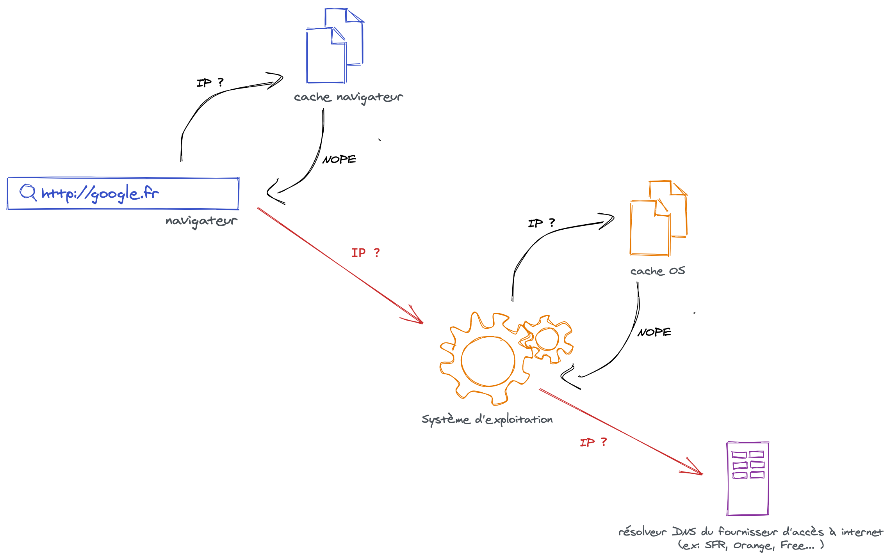
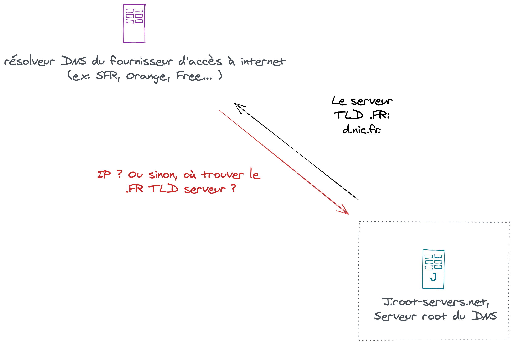
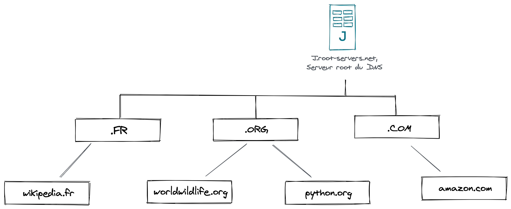
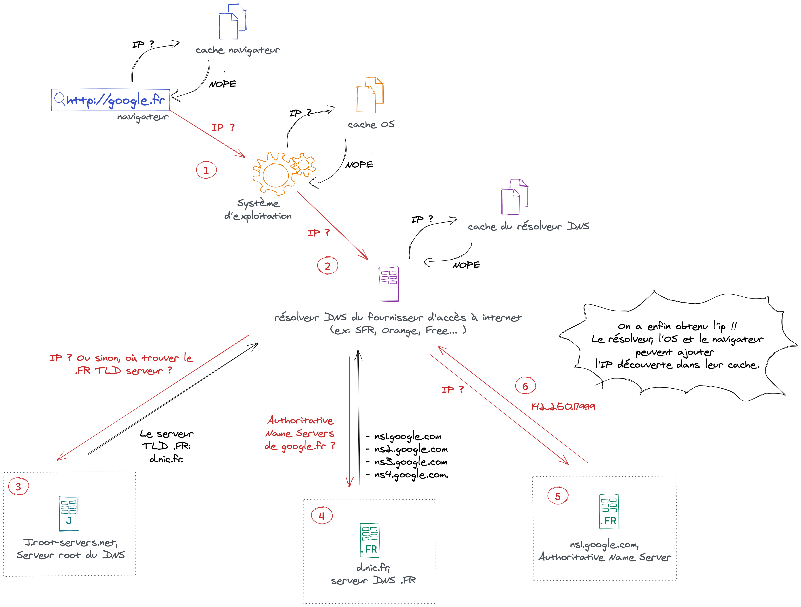

Durant notre vie de développeur web, nous entendons forcément parler de DNS. 
Nous savons qu'il se passe des choses derrière notre ordinateur lorsque nous requêtons https://google.fr qui nous permettent d'accéder à notre page web. Pourtant, toute cette tambouille est cachée à nos yeux et nous pouvons accéder à https://google.fr sans problème. Alors pourquoi s'y intéresser ? 

En tant que développeur, il arrive que nous ayons besoin de créer de nouveaux noms de domaines, ou d'en modifier. Certaines problématiques de réseaux peuvent survenir alors: URL web non accessible, un changement DNS non pris en compte... Connaître le fonctionnement du DNS peut nous aider à identifier ce qui pose problème dans le réseau.


## DNS lookup de bout-en-bout

Examinons ensemble ce qu'il se passe lorsque nous requêtons une page, https://google.fr par exemple. Dans ce cas, le nom de domaine est "google.fr".

1. Après avoir tapé l'url dans le **navigateur**, celui-ci va chercher dans son cache s'il connaît l'adresse IP associé à ce nom de domain. S'il ne la connaît pas, il va alors interroger le **système d'exploitation**. Si aucun des deux ne connait, alors le **resolver DNS** de notre fournisseur d'accès internet sera interrogé.

   

2. Le resolveur DNS interroge alors son cache. S'il ne connait pas l'adresse IP associé au domaine, il va s'adresser à des serveurs DNS racines (appelés "root" en anglais).

   > Les éléments mis dans le cache possèdent des TTL (time to live) qui indiquent pendant combien de temps ils sont valides. Passé ce délais, il faudra mettre à jour ces entrées du cache.

3. Si **serveur DNS root** connaît l'adresse IP associé au nom de domaine google.fr, il le communiquera au résolveur qui remontera ensuite l'information à l'OS puis au navigateur. 

   Dans le cas contraire, si le serveur DNS root connait l'adresse du serveur TLD .FR, il renverra cette adresse au résolveur, sinon le résolveur s'adressera à un autre serveur root.

   

   Il existe 13 serveurs root dans le monde, nommé A, B, C... à M. Chaque serveur root est associé à une adresse: a.root-servers.net, b.root-servers.net, c.root-servers.net, etc. Ils sont au sommet de la hiérarchie DNS. À eux 13, ils connaissent tous les IP associés aux noms de domaine. Chaque serveur root est distribué à plusieurs endroits dans le monde, pour éviter d'avoir un seul serveur physique.

   > Comment le résolveur trouve-t-il le serveur root ? Chaque résolveur DNS connait à son démarrage l'adresse des 13 serveurs root. Lors d'un lookup DNS, le résolveur commence par requêter le premier serveur root de la liste (k.root-servers.net par exemple). Si celui-ci n'est pas disponible ou ne possède pas l'information recherché, le serveur root suivant est requêté (f.root-servers.net par exemple).

   


4. Le **serveur TLD** regardera ce que l'on appelle le nom de domaine de premier niveau (Top Level Domain), qui est ".FR" dans notre exemple. Il provient du nom de domaine "google.fr". 

   Le serveur TLD redirigera ensuite le résolveur vers les serveurs de noms faisant authorité (Authoritative Name Server). Dans notre exemple, il s'agit de :

   - ns1.google.com
   - ns2.google.com
   - ns3.google.com
   - ns4.google.com.

5. Le résolveur requêtera alors un à un les Authoritative Name Servers ci-dessus jusqu'à trouver celui qui connaît l'adresse IP de google.fr.

6. Une fois l'IP trouvée, le résolveur la stocke dans son cache. L'information est transmise à l'OS puis au navigateur qui enregistre aussi l'IP dans leur cache.

<br>

Le schéma de fonctionnement obtenu devient:




## Exécuter une requête DNS

Le cheminement suivi lors du lookup DNS peut-être examiné avec la commande `dig +trace`:

```sh
> dig +trace google.fr
.			488309	IN	NS	b.root-servers.net.
fr.			172800	IN	NS	d.nic.fr.
google.fr.		172800	IN	NS	ns3.google.com.
google.fr.		300	IN	A	142.250.179.99
```

La première ligne retourné correspond à la requête vers le serveur DNS root "b.root-servers.net".

La 2e ligne correspond à la requête vers le serveur TLD, et finalement la 3e ligne est celle vers le Authoritative Name Server. 

On obtient finalement l'IP de google.fr ! 

## Propagation DNS explained !

Lorsque l'on modifie le DNS pour qu'un nom de domaine pointe sur une autre adresse IP, la modification n'est pas immédiatement visible sur navigateur: c'est la propagation DNS !

|                    | Domain       | IP            |
| ------------------ | ------------ | ------------- |
| avant modification | exemple.fr | 104.28.5.98   |
| après modification | exemple.fr | 132.30.160.99 |

La propagation DNS est le délais nécessaire pour que les différents serveurs mettent à jour leur cache. 

## TLDR

Pour résumer: pour récupérer une page web "https://google.fr", nous avons besoin de connaître l'adresse IP associé au nom de domaine "google.fr".

Pour cela:
- le navigateur va passer par le système d'exploitation de l'ordinateur puis le résolveur DNS du fournisseur internet.

Si aucun de ces deux éléments n'a l'adresse IP, alors on va décomposer le nom de domaine google.fr:
- on interroge en root serveur en premier pour savoir où trouver le serveur TLD qui connaît ".FR"
- on interroge ce serveur TLD ".FR" pour connaître le serveur de nom faisant autorité qui connait "google.fr"
- le serveur de nom faisant autorité nous donne l'adresse IP de "google.fr"


