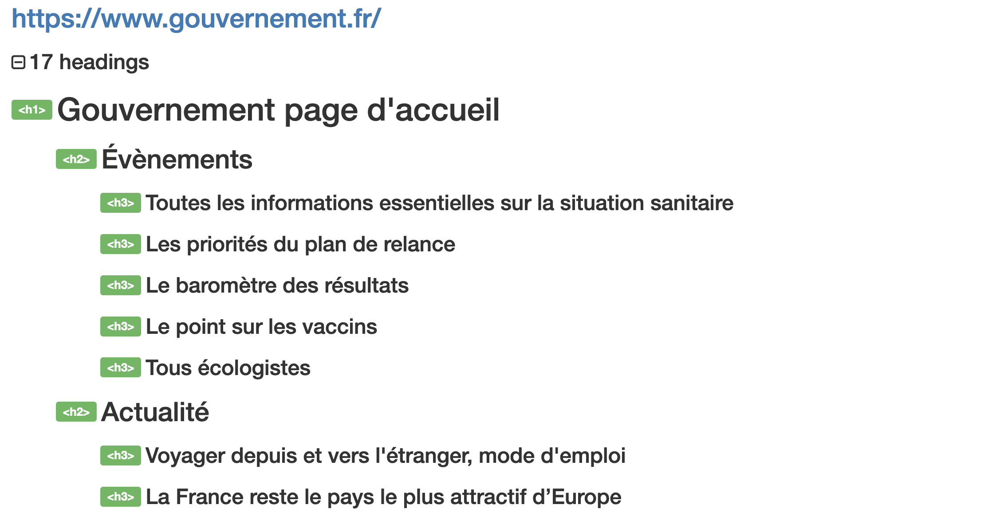
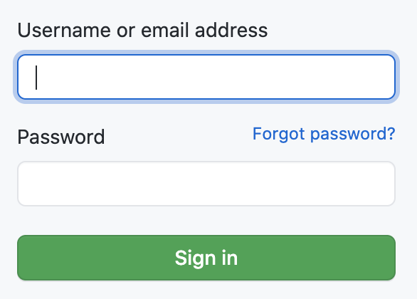
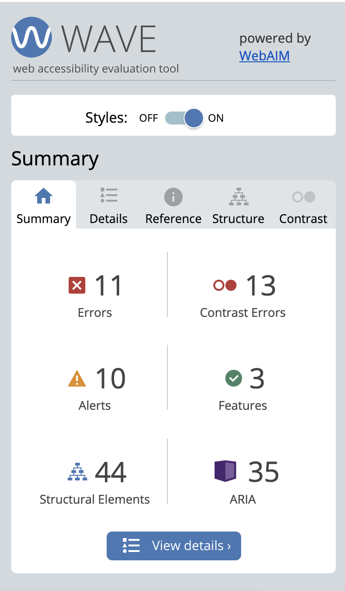
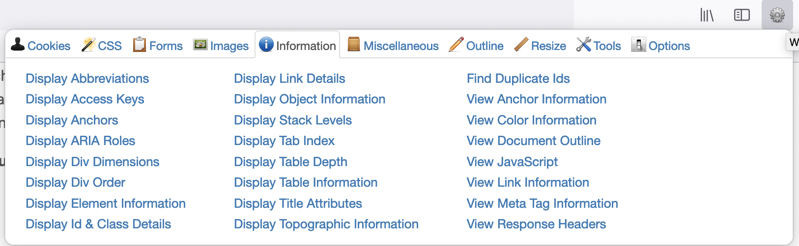

L'accessibilité web bénéficie à tous. Elle permet de rendre accessible un site internet pour le plus grand nombre de personnes, que ce soit des personnes ayant des handicaps temporaires (ex: bras cassé) ou handicaps permanents (ex: aveugles), que ce soit des personnes qui naviguent sur des smartphones ou des ordinateurs, ou encore des personnes qui ont une connection 5G ou une connection lente, etc.

En tant que développeur, il est donc de notre devoir de nous assurer de l'accessibilité du produit final.


## Checklist du développeur

Je ne suis pas experte en accessibilité. Néanmoins, je comprends son importance et je me renseigne sur les moyens de rendre accessible une page web. Durant mon expérience chez [Pix](), j'ai aussi contribué à améliorer l'accessibilité de quelques unes de ses pages.

Je regroupe ci-dessous quelques éléments qui attirent désormais mon attention sur l'accessibilité d'un site:

### 1. HTML valide

La première étape consiste à vérifier que le HTML écrit a une syntaxe valide.

N'hésitez pas à vous reférer aux documentations HTML ou au validateur [W3C validator](https://validator.w3.org/).

### 2. Navigation

- Navigation au clavier

L'une des premières choses que je fais pour vérifier l'accessibilité d'un site est de vérifier la navigabilité au clavier. Que se passe-t-il lorsque l'appuie sur la touche de tabulation ? En appuyant successivement sur la touche de tabulation, je dois pouvoir naviguer sur les boutons d'actions et les liens. La navigation clavier est très importante car de nombreuses personnes en situation de handicap moteur utilisent la navigation clavier.

- Site responsive

Le site doit être accessible aussi bien sur grand écran que sur petit écran, sans barre de défilement horizontal.

- Bouton vs Liens

Avec le CSS, il est possible de styliser un lien comme un bouton et inversement. Alors respectons la sémantique HTML: un lien `<a>` permet d'accéder à une autre page web ou à un ancre, un bouton `<button>` déclenche une action. Si l'on veut ouvrir une popup, on utilisera un tag `<button>`. Si l'on veut rediriger vers la page d'accueil on utilisera un tag `<a>`. 

Utiliser correctement les tags HTML évite les mauvaises surprises aux utilisateurs. Si un utilisateur malvoyant utilise un outil de lecteur d'écran, cet outil lui signale un bouton mais qu'après avoir cliqué dessus il est redirigé sur une nouvelle page, l'utilisateur qui ne s'y attendrait pas pourrait être perdu.

Pour aller plus loin: [Différence entre bouton et lien](https://a11y-101.com/design/button-vs-link)

- Avoir des larges zones cliquables

Parce que ce n'est pas simple de devoir cliquer sur une petite zone de texte, que ce soit avec la souris ou avec le doigt.

### 3. Structure

- Titre unique de la page

Chaque page doit avoir un titre unique, court et descriptif. En plus de contribuer à l'indexation d'une page (SEO), les personnes qui utilisent des outils d'assistance ont besoin de ce titre pour identifier le site web sans avoir besoin de naviguer dans son contenu.

Pour aller plus loin: [Renseigner un title précis sur chaque page](https://www.accede-web.com/notices/html-et-css/titre-de-la-page/renseigner-un-title-precis-sur-chaque-page/)

- Titres de la page

Une page doit pouvoir être parcourue rapidement via ses titres. Nous le faisons visuellement en lisant "les gros titres" de la page. Les personnes avec des outils d'assistance peuvent de leur côté afficher listes des titres et accéder directement au contenu voulu.

Exemple de structure de la page www.gouvernement.fr:



On remarque que sur cette page web la hiérarchie des titres est bien respectée. On commence bien par un titre de niveau `h1`. Les titres de niveau `h2` sont en dessous d'un `h1` et les `h3` sont bien en-dessous de `h2`.

### 4. Images et médias

 S'ils véhiculent une information, les contenus visuels (images, vidéos, icônes, etc), ont besoin d'être décrit via l'attribut `alt`.

Par exemple:

```html

```

Ici, si l'utilisateur ne voit pas l'image et si l'attribut `alt` était absent, alors l'utilisateur aurait perdu une information. Ce texte est très utile: il sera interprété par les lecteurs d'écran, mais sera aussi affiché lorsque les images ne se chargent pas.

Dans le cas contraire où l'image n'apporte aucune information et qu'elle n'est là qu'à titre décorative, alors son attribut `alt` doit être laissé vide:

```html

```

Pour apprendre à distinguer les images informatives des images décoratives, je vous invite à suivre ce guide de W3C: [arbre de décision](https://www.w3.org/WAI/tutorials/images/decision-tree/).

### 5. Formulaire

- Indiquer les champs obligatoires

Pour aller plus loin: [Indiquer clairement les champs obligatoires](https://www.accede-web.com/notices/fonctionnelle-graphique/formulaires/indiquer-clairement-les-champs-obligatoires/)

- Avoir un label sur chaque champ

Un placeholder à l'intérieur d'un input ne sert pas de label car peu accessible aux outils d'assistances. Il nous faut pouvoir expliciter ce que correspond chaque champ de saisie.

Visuellement nous pouvons avoir:



Implémenté avec un `<label>` . Notons ci-dessous que le label est ainsi lié à l'input via les attribut `for` et `id`:

```html
<label for="login">
  Username or email address
</label>
<input type="text" name="login" id="login" class="form-control input-block" autocapitalize="off" autocorrect="off" autocomplete="username" autofocus="autofocus">
```

Pour aller plus loin: [Élement label](https://developer.mozilla.org/fr/docs/Web/HTML/Element/Label)

Dans certains cas, il se peut que nous ne voulions pas afficher à l'écran le label. Il faut alors que s'assurer que les outils d'assistance puissent décrire le champs. Imaginez si tous les champs de formulaires n'ont pas de labels, comment une personne malvoyante avec son outil d'assistance pourrait-elle distinguer un champ d'un autre ? Plusieurs solutions existent en passant du CSS à l'ajout de nouveaux attributs... Pour aller plus loin: [Labelling Controls](https://www.w3.org/WAI/tutorials/forms/labels/)

## Législation

L'État impose désormais un accès équitable au contenu public en ligne.

Cela concerne non seulement les sites du public mais aussi du privé qui répondent à des besoins d’intérêt général, ou qui génèrent un chiffre d'affaire annuel de plus de 250 millions d’euros.

Pour en savoir plus sur les types de contenu concernés: [Référentiel général d'amélioration de l'accessibilité – RGAA Version 4.1](https://www.numerique.gouv.fr/publications/rgaa-accessibilite/obligations/#contenus-concern%C3%A9s)

Pour être en conformité:

- le site doit [suivre le référentiel d'amélioration de l'accessibilité (RGAA)](https://www.numerique.gouv.fr/publications/rgaa-accessibilite/methode-rgaa/criteres/)

- ou sinon le site doit posséder une page de déclaration du niveau d'accessibilité atteint ("Conformité totale": 100% les critères du RGAA sont respectés, "Conformité partielle" ou "Non-conformité"). Pour en savoir plus sur ce que doit contenir cette déclaration: [Déclaration d’accessibilité](https://www.numerique.gouv.fr/publications/rgaa-accessibilite/obligations/#d%C3%A9claration-daccessibilit%C3%A9)

En cas de non conformité aux exigences, les sociétés concernées risquent une amende fixée à 20 000 euros annuel par produit et par année.

## Plugin Wave / Firefox Web Developer

Lors de mes développements, j'utilise les plugins Wave ou Firefox Web Developer pour m'aider à améliorer l'accessibilité des sites web.

### Wave

Ce plugin disponible sur Chrome et Firefox permet d'avoir des informations sur l'accessibilité d'un site web.

Je me positionne sur un site et j'active le plugin:



Wave nous fournit instantanément un résumé de l'état d'accessibilité d'un site. En naviguant dans les différents onglets, Wave pointe les erreurs et donne des explications pour nous amener à les corriger.

On retrouve sur Wave la structure des titres de la page, les problèmes de contrastes, les oublis d'attributs `alt`, `label`, etc.


### Firefox Web Developer

En complément, j'utilise aussi l'addon Firefox Web Developer: 



